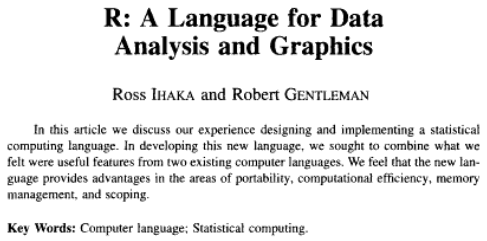
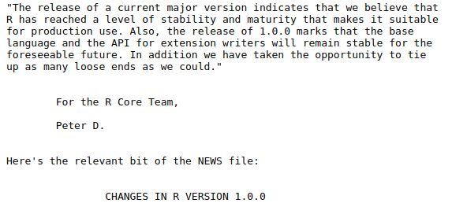
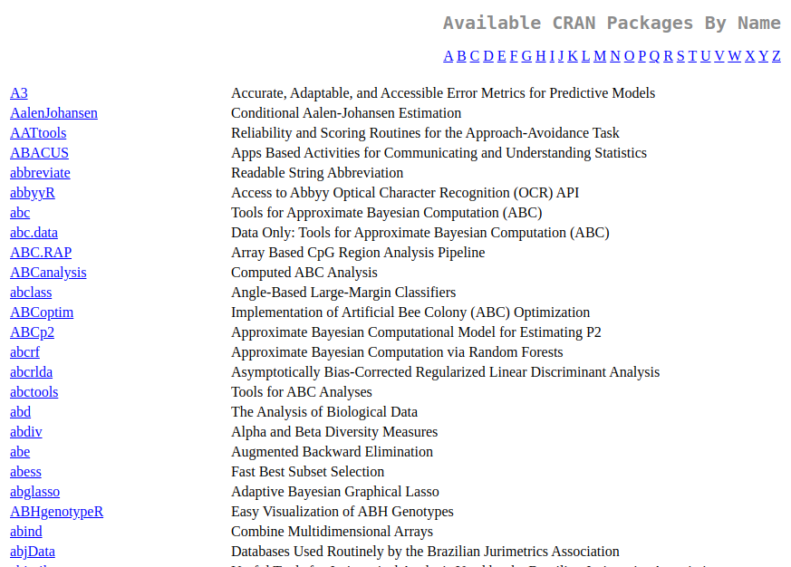

```{r, include = FALSE}
source("./config/setup.R")
```

## Estatística e o desenvolvimento computacional

\beginAHalfColumn

 - A popularização da Estatística se dá graças ao \textbf{desenvolvimento computacional}.

 - Os computadores pessoais tornaram os métodos estatísticos mais acessíveis ao público geral por meio de \textbf{softwares} que implementam as metodologias.

 - Devido ao avanço computacional, houve um aumento considerável na capacidade de produzir e armazenar dados provenientes das mais diversas fontes.

\endColumns
\beginAHalfColumn

```{r, echo = FALSE, out.width='60%', fig.align='center', fig.cap="Extraído de \\href{https://cdn.pixabay.com/photo/2020/04/04/04/23/graph-5000784_1280.png}{pixabay.com.}"}

knitr::include_graphics("./img/desenvolvimento-computacional.png")
```

\endColumns

## Estatística e o desenvolvimento computacional

\beginAHalfColumn

 - Graças ao avanço computacional podemos lidar com a manipulação de \textbf{grandes conjuntos de dados}.

 - Este grande volume de dados também força o \textbf{desenvolvimento dos métodos estatísticos} e softwares para análise de dados.

 - A capacidade computacional atual também desperta o interesse por \textbf{métodos estatísticos computacionalmente intensivos}.

\endColumns
\beginAHalfColumn

```{r, echo = FALSE, out.width='60%', fig.align='center', fig.cap="Extraído de \\href{https://cdn.pixabay.com/photo/2015/04/14/23/17/it-business-722950_1280.png}{pixabay.com.}"}

knitr::include_graphics("./img/ti.png")
```

\endColumns

## Ferramentas para análises estatísticas

Existem diversas ferramentas disponíveis:

\beginAHalfColumn

 - R;

 - Python;

 - SAS;

 - Spss;

 - Biostat;
 
 - Minitab;

 - Tableau;

 - Stata;

 - E diversas outras.

\endColumns
\beginAHalfColumn

```{r, echo = FALSE, out.width='80%', fig.align='center', fig.cap="Extraído de \\href{https://cdn.pixabay.com/photo/2018/06/08/00/48/developer-3461405_960_720.png}{pixabay.com.}"}

knitr::include_graphics("./img/programacao.png")
```

\endColumns

## Ferramentas para análises estatísticas

Existem diversas ferramentas disponíveis:

\beginAHalfColumn

 - **R**;

 - Python;

 - SAS;

 - Spss;

 - Biostat;
 
 - Minitab;

 - Tableau;

 - Stata;

 - E diversas outras.

\endColumns
\beginAHalfColumn

```{r, echo = FALSE, out.width='80%', fig.align='center', fig.cap="Logo do R."}

knitr::include_graphics("./img/rlogo.png")
```

\endColumns

## R


 -  R é uma linguagem e ambiente para \textbf{computação estatística} e \textbf{gráficos}.
 
 - É \textbf{livre} e de \textbf{código aberto}.
    - Livre (free): usuários tem liberdade de:
        1. executar como desejar e para qualquer propósito.
        2. estudar o funcionamento e adapta-lo à necessidades específicas.
        3. distribuir cópias de versões originais e modificadas.
    - Código aberto (open source): o acesso ao código fonte é gratuito.
    

## R

 -  Muito popular no meio \textbf{acadêmico} e tem uso cada vez maior no meio \textbf{corporativo}.
    - É acessível e gratuito.
    - Tem diversas técnicas e aplicações possíveis.

 - Tem potencial uso em todas as etapas do processo de análise de dados.
    - Obtenção, importação, manipulação e tratamento.
    - Análise exploratória.
    - Ajuste de modelos estatísticos, modelos de aprendizado de máquina, dentre outros.
    - Elaboração de relatórios dinâmicos e reproduzíveis.

## Antes do R

 - O R sucedeu a lingugem S, de \textbf{John Chambers}, Rick Becker, Trevor Hastie, Allan Wilks e outros.

 - A linguagem S foi iniciada em 1976 e disponibilizada publicamente no início dos anos 80 já como um ambiente de análise estatística.


 - Uma das principais limitações da linguagem S era que ela só estava disponível em um \textbf{pacote comercial}: o S-PLUS. O que motivou a criação do R.

 - Quando o R foi desenvolvido a sintaxe era muito semelhante ao S, pensando na migração dos usuários de uma linguagem para outra.

## História do R

\beginAHalfColumn

 - Em \textbf{1991} o R foi criado por Ross Ihaka e Robert Gentleman ("\textbf{R \& R}") no Departamento de Estatística da Universidade de Auckland.

 - Em \textbf{1993} o R foi \textbf{anunciado publicamente} pela primeira vez.

 - Em \textbf{1995} o R passou a usar a \textbf{GNU General Public License}, o que tornou o R um software livre e de código aberto.

\endColumns
\beginAHalfColumn

```{r, echo = FALSE, out.width='80%', fig.align='center', fig.cap="Robert Gentleman e Ross Ihaka."}
knitr::include_graphics("./img/r&r.png")
```

\endColumns

## História do R


\beginAHalfColumn

 - Em \textbf{1996} foi publicado o \textbf{artigo} em que Ross e Robert descrevem sua proposta: "\emph{R: A language for data analysis and graphics.}" no Journal of Computational and Graphical Statistics.
 
 - Ainda em \textbf{1996} foram criadas as listas de discussão \textbf{R-help} e \textbf{R-devel}.

\endColumns
\beginAHalfColumn

```{r, echo = FALSE, out.width='80%', fig.align='center', fig.cap="Artigo original do R."}

```

\endColumns

## História do R


 - Em \textbf{1997} foi formado o \textbf{R Core Team}: um grupo de aproximadamente 20 desenvolvedores que mantêm, gerenciam, controlam o código fonte e orientam a evolução da linguagem.
 
 - Os membros do R Core Team fundaram a \textbf{R Foundation}: uma organização sem fins lucrativos que trabalha no interesse público para dar suporte ao R.

 - Os direitos autorais do código-fonte primário do R pertencem à R Foundation e são publicados sob a GNU General Public License versão 2.0.
 
## História do R


\beginAHalfColumn

 - Em \textbf{2000} o R 1.0.0 foi lançado.

  - O R base está disponível para instalação no \textbf{Comprehensive R Archive Network}, também conhecido como \textbf{CRAN}.

\endColumns
\beginAHalfColumn

```{r, echo = FALSE, out.width='80%', fig.align='center', fig.cap="R 1.0.0."}

```

\endColumns

## O que é o R

 - O R é uma \textbf{linguagem de programação}.
 
 - Você faz a análise de dados escrevendo \textbf{funções e scripts}, não apontando, clicando e arrastando caixas.
 
 - Para quem nunca programou, parece assustador. Mas o R é fácil de aprender e guiado a análise de dados.
 
 - É possível instalar e usar o R nos principais sistemas operacionais.

 - Assim como vários outros softwares livres e de código aberto, o R tem lançamentos frequentes de \textbf{versões}.
 
 - A comunidade R é altamente ativa com usuários no mundo todo que contribuem, desenvolvem pacotes e ajudam uns aos outros por meio de materiais online como listas de discussão e tutoriais.

## R e os pacotes


\beginAHalfColumn

 - \textbf{Pacotes R} são coleções de funções R, dados e código compilado.

 - O R já vem com um conjunto de pacotes por padrão e outros podem ser adicionados para estender os recursos.

 - Os pacotes hoje disponíveis são o resultado de anos de colaboração de pessoas de todo o mundo.

 - Uma das funções do CRAN é hospedar diversos pacotes complementares.

\endColumns
\beginAHalfColumn

```{r, echo = FALSE, out.width='60%', fig.align='center', fig.cap="Extraído de \\href{https://cdn.pixabay.com/photo/2014/12/21/23/35/parcel-575623_960_720.png}{pixabay.com.}"}

knitr::include_graphics("./img/pacote.png")
```

\endColumns


## R-base

 - O R “base” contém o pacote básico necessário para executar o R e as funções mais fundamentais.

 - As funções já vem disponíveis, prontas para chamada e uso.

 - É composto por \textbf{15} pacotes:
 
\beginAHalfColumn

 1. `base`
 2. `compiler`
 3. `datasets`
 4. `grDevices`
 5. `graphics`
 6. `grid`
 7. `methods`
 8. `parallel`

\endColumns
\beginAHalfColumn

 9. `splines`
 10. `stats`
 11. `stats4`
 12. `tcltk`
 13. `tools`
 14. `translations`
 15. `utils`.
 
\endColumns

## R-recommended


 - Um segundo grupo de pacotes que já vem com a instalação do R são os pacotes "recomendados".

 - Apesar de já instaladas, estas bibliotecas precisam ser chamadas para que seja possível usar as funções.

 - É composto por outros \textbf{15} pacotes. 
 
 \beginAHalfColumn
 
1. `KernSmooth`
2. `MASS`
3. `Matrix`
4. `boot`
5. `class`
6. `cluster`
7. `codetools`
8. `foreign`

\endColumns
\beginAHalfColumn


9. `lattice`
10. `mgcv`
11. `nlme`
12. `nnet`
13. `rpart`
14. `spatial`
15. `survival`.

\endColumns


## Outros pacotes

\beginAHalfColumn

 - Você pode facilmente obter e instalar pacotes além dos 30 que já vem com a instalação tradicional do R.
 
 - A principal fonte de pacotes é o próprio CRAN, que hoje conta com \textbf{mais de 19000 pacotes}.
 
 - Fontes secundárias envolvem páginas web e repositórios como github, onde desenvolvedores mantém pacotes em desenvolvimento.

\endColumns
\beginAHalfColumn

```{r, echo = FALSE, out.width='90%', fig.align='center', fig.cap="Lista de pacotes disponíveis por nome no CRAN."}


```

\endColumns


## Limitações

 - O R é essencialmente baseado em tecnologia antiga (sistema S da Bell Labs).

 - Por ser baseado em tecnologia antiga o R sofre com suporte para algumas ferramentas modernas como gráficos dinâmicos.

 - O R demanda memória física, os objetos geralmente são armazenados em memória. É algo que vem sendo melhorado aos poucos.
 
 - O R depende dos seus usuários. Os novos recursos dependem do interesse da comunidade. A partir do momento em que o interesse acabar, o R ficará estagnado.

## Em resumo

O R fornece

 - Diversos recursos de Estatística.
 - Diversos recursos gráficos.
 - Uma vasta coleção de pacotes oficiais e não oficiais.
 - Uma linguagem de programação bem desenvolvida, simples e eficaz.
 - Possibilidade de instalação e uso em uma ampla variedade de plataformas UNIX e sistemas similares (incluindo FreeBSD e Linux), Windows e MacOS.
 - Possibilidade de uso de códigos C, C++ e Fortran para tarefas computacionalmente intesivas.
 - Documentação padronizada.
 
## IDEs e Editores

\beginAHalfColumn

 - Existem softwares adicionais úteis para ajudar a programar de forma mais rápida e eficiente. 
 
 - As IDE's (_Integrated Development Environment_) são softwares que oferecem algumas facilidades para se programar em determinada linguagem.

 - Já os editores tendem a ser úteis para múltiplas linguagens e fornecem mais alternativas de customização.

\endColumns
\beginAHalfColumn

 - Para trabalhar em R, dentre IDEs e editores, o RStudio IDE é a opção mais famosa.

\vspace{1cm}

```{r, echo = FALSE, out.width='60%', fig.align='center', fig.cap="Logo do RStudio."}

knitr::include_graphics("./img/rstudiologo.png")
```

\endColumns

## Links

\beginAHalfColumn

 - \href{https://cran.r-project.org/}{\color{blue}{The Comprehensive R Archive Network}}.
 
  - \href{https://posit.co/download/rstudio-desktop/}{\color{blue}{RStudio Desktop}}.
  
  - \href{https://posit.cloud/plans/free}{\color{blue}{Posit Cloud}}.

\endColumns
\beginAHalfColumn

\endColumns
 
## Materiais para aprender R

 - Mayer, FP; Bonat, WH; Zeviani, WM; Krainski, EK; Ribeiro Jr., PJ. \href{http://cursos.leg.ufpr.br/ecr/}{\color{blue}{Estatística Computacional com R}}. DEST/UFPR, 2018.

 - Ribeiro Jr., PJ. \href{http://www.leg.ufpr.br/~paulojus/embrapa/Rembrapa/}{\color{blue}{Introdução ao Ambiente Estatístico R}}. 2011.

 - Horton, NJ; Pruim, R; Kaplan, DT. \href{http://cran-r.c3sl.ufpr.br/doc/contrib/Horton+Pruim+Kaplan_MOSAIC-StudentGuide.pdf}{\color{blue}{A Student's Guide to R}}. 2015.

 - Maindonald, JH. \href{http://cran-r.c3sl.ufpr.br/doc/contrib/usingR.pdf}{\color{blue}{Using R for Data Analysis and Graphics}}. 2008.

 - Paradis, E. \href{http://cran-r.c3sl.ufpr.br/doc/contrib/Paradis-rdebuts_en.pdf}{\color{blue}{R for Beginners}}. 2005.


## Referências

PENG, Roger D. \href{https://bookdown.org/rdpeng/rprogdatascience/}{\color{blue}{R programming for data science}}. Victoria, BC, Canada: Leanpub, 2016.

IHAKA, Ross. \href{https://www.stat.auckland.ac.nz/~ihaka/downloads/Interface98.pdf}{\color{blue}{R: Past and future history}}. Computing Science and Statistics, v. 392396, 1998.

Microsoft R Application Network. \href{https://mran.microsoft.com/documents/what-is-r}{\color{blue}{What is R?}}

The R Project for Statistical Computing. \href{https://www.r-project.org/about.html}{\color{blue}{What is R?}}


