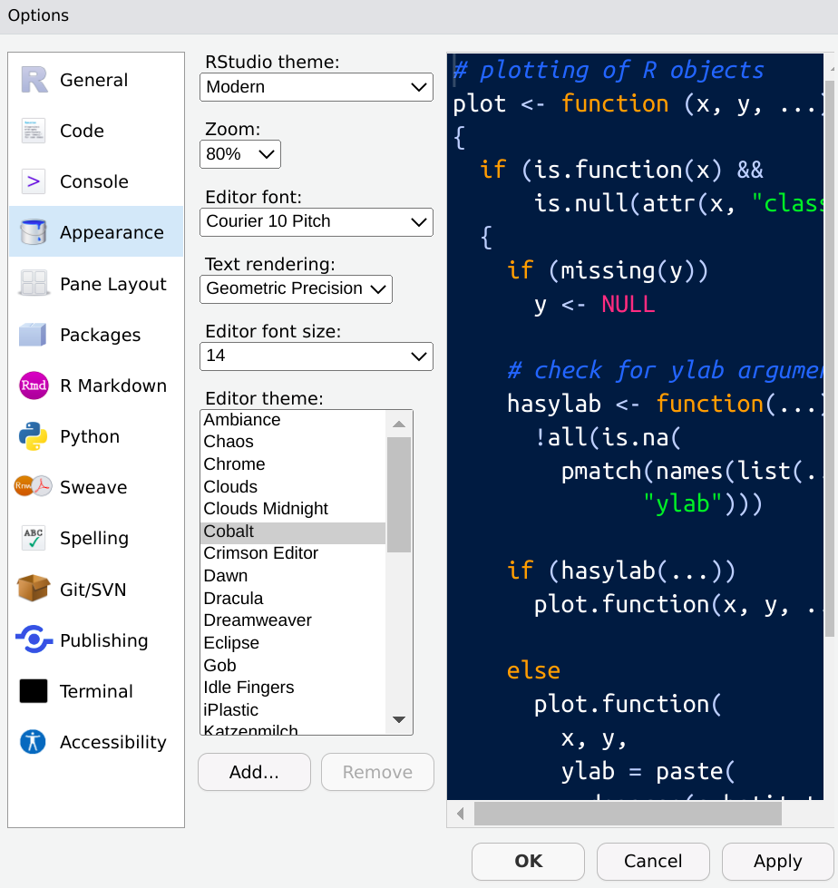

```{r, include = FALSE}
source("./config/setup.R")
```

## Introdução

 - O R é uma \textbf{linguagem de programação}.

 - Uma linguagem de programação é a forma que nós nos comunicamos com o computador.

 - Escrevemos um código R para que o computador entenda e execute a tarefa de interesse.

 - O R trabalha com a ideia de interface de linha de comando (command line interface). 

 - Precisamos escrever os códigos para que a linguagem passe para o computador executar.

## Introdução

\beginAHalfColumn

 - Atenção: 
  	- O R é a \textbf{linguagem}.
 	- O RStudio é a \textbf{interface}.
	- Quem faz o trabalho (manda a solicitação para que o computador execute) é o R!

\endColumns
\beginAHalfColumn

```{r, echo = FALSE, out.width='60%', fig.align='center', fig.cap="Extraído de \\href{https://cdn.pixabay.com/photo/2013/04/01/10/57/exclamation-mark-98739_1280.png}{pixabay.com.}"}

knitr::include_graphics("./img/atencao.png")
```

\endColumns

## Introdução

 - Geralmente, trabalhando em R escrevemos o código, executamos, avaliamos o resultado e seguimos acrescentando as instruções até obter o resultado esperado. 
    - Modo \textbf{REPL}: Read, Eval, Print and Loop

 - Outra forma de trabalhar é escrever toda a sequência de código e executá-la de uma única vez. 
      - Esta ideia é útil para ambientes de produção nos quais não há supervisão. 
      - Chamado de modo \textbf{Batch}.

# Abrindo o RStudio

## Abrindo o RStudio

\beginAHalfColumn

 - O RStudio como IDE tem o papel de facilitar o trabalho em R.

 - Portanto, ao abrir o RStudio, tudo que você precisa deve estar à mostra e com fácil acesso.

 - Ao abrir o RStudio você verá uma estrutura organizada em paineis.

\endColumns
\beginAHalfColumn

```{r, echo = FALSE, out.width='60%', fig.align='center', fig.cap="Logo do RStudio."}

knitr::include_graphics("./img/rstudiologo.png")
```

\endColumns

## Abrindo o RStudio

```{r, echo = FALSE, out.width='85%', fig.align='center', fig.cap="Tela inicial do RStudio."}
knitr::include_graphics("./img/rstudio.png")
```

## Paineis

 - No \textbf{canto superior esquerdo} é onde digitamos o código R que será executado: o \textbf{editor}.
	- Se o R está recém instalado ou a sessão é nova, crie um arquivo .R clicando em `File > New File > R` ou use as teclas de atalho `Ctrl + Shift + N`.

 - No \textbf{canto inferior esquerdo} é onde o terminal R está, é ali onde o código é interpretado e executado: o \textbf{console}.

 - No canto superior direito são mostradas informações do ambiente de trabalho, histórico, conexões, etc.

 - No canto inferior direito são apresentados os arquivos da pasta de trabalho, gráficos, pacotes, documentação etc.
 
## Editor

```{r, echo = FALSE, out.width='85%', fig.align='center', fig.cap="Tela inicial do RStudio. Foco no editor."}
knitr::include_graphics("./img/editor.png")
```

## Console

```{r, echo = FALSE, out.width='85%', fig.align='center', fig.cap="Tela inicial do RStudio. Foco no console."}
knitr::include_graphics("./img/console.png")
```

## Ambiente, histórico, conexões

```{r, echo = FALSE, out.width='85%', fig.align='center', fig.cap="Tela inicial do RStudio. Foco no ambiente, histórico e conexões."}
knitr::include_graphics("./img/env.png")
```

## Arquivos, gráficos, pacotes e documentação

```{r, echo = FALSE, out.width='85%', fig.align='center', fig.cap="Tela inicial do RStudio. Foco nos arquivos, pacotes e documentação."}
knitr::include_graphics("./img/files.png")
```


## Principais elementos

Em resumo:

 - \textbf{Editor}: onde escrevemos os códigos.
 - \textbf{Console}: onde os resultados são printados.
 - \textbf{Environment}: mostra todos os objetos criados.
 - \textbf{History}: mostra todos os códigos executados.
 - \textbf{Files}: mostra os arquivos no diretório atual.
 - \textbf{Plots}: mostra os outputs de códigos que geram gráficos.
 - \textbf{Packages}: mostra os pacotes instalados.
 - \textbf{Help}: mostra a documentação de funções e pacotes.

\textbf{Dica}: Para obter todos os atalhos da interface digite pressione `ALT+SHIFT+K`.

## Customizando o RStudio

\beginAHalfColumn

 - O RStudio permite customizar os elementos. 
 
 - Experimente acessar `Tools > Global Options > Appearance` para trocar temas, ordem dos paineis, tamanho da fonte, etc. 
 
 - Deixe o RStudio confortável para você.

\endColumns
\beginAHalfColumn

```{r, echo = FALSE, out.width='85%', fig.align='center', fig.cap="Tela inicial do RStudio."}

```

\endColumns

# Trabalhando com R no RStudio

## Primeiros passos

1. Crie uma pasta em algum lugar do seu computador para trabalhar.

2. Abra o RStudio e defina o diretório de trabalho.
    - O diretório de trabalho é a pasta do R onde estamos trabalhando.
    - `Session > Set Working Directory > Choose Directory...` ou `CTRL + SHIFT + H`.
        - Ambas as opções darão a possibilidade de escolher a pasta de interesse no computador onde manteremos nossos arquivos.

## Primeiros passos

3. Crie um arquivo com extensão .R.
    - `File > New File > R script`.
    - `CTRL + SHIFT + N`.

4. Salve seu script.
    - Esta etapa funciona como qualquer arquivo do computador.
    - `File > Save` ou `CTRL + S`.
    - De um nome para seu arquivo.
        - Opte por nomes curtos, intuitivos e evite espaços, acentos e caracteres.

Agora estamos prontos para trabalhar!

## Instruções e comentários

 - Uma \textbf{instrução} é um código a ser executado.
 
 - Um \textbf{comentário} é algo que escrevemos no script mas que não temos interesse que seja executado.
 
 - Comentários podem e devem ser usados para \textbf{documentar} o código.
 
 - Tudo que vier após `#` é um comentário e não será executado pela linguagem.
 
## Executando

 - Para executar uma instrução no RStudio basta ir até a linha de interesse e teclar `CTRL + ENTER`. 
 
 - O código é interpretado, executado e o resultado é mostrado na tela.

 - Uma recomendação para scripts mais organizados é não ultrapassar $72$ ou $80$ caracteres por linha.

 - Outra recomendação diz respeito à indentação ou alinhamento do código.           
      - Use `CTRL+i` no RStudio para indentar automaticamente. 

# R como calculadora

## R como calculadora

 - O R pode ser usado como uma poderosa \textbf{calculadora científica}.

 - Os operadores seguem uma hierarquia, ou seja, uma ordem de precedência.
    - Inicialmente são efetuadas as operações entre parênteses seguindo a ordem: exponenciação, multiplicação/divisão e por fim adição/subtração.

 - Para utilizar os operadores no R basta digitar os valores e a operação diretamente no console (caso queira ver somente o resultado) ou no editor (caso deseje salvar o código no arquivo .R).

## Operações aritméticas básicas

\beginAThirdColumn

```{r}
# Soma
1 + 1 

# Subtração
1 - 1 

# Multiplicação
2 * 2 
```

\endColumns
\beginAThirdColumn

```{r}
# Divisão
4/2 

# Potenciação
5^2 

# Radiciação
2^(1/3) 
```

\endColumns
\beginAThirdColumn

```{r}
# Resto
10 %% 3

# Parte inteira
10 %/% 3 
```

\endColumns

## Funções trigonométricas

\beginAHalfColumn

```{r}
# Seno
sin(0) 

# Cosseno
cos(0) 

# Tangente
tan(0) 
```

\endColumns
\beginAHalfColumn

```{r}
# Arco seno
asin(0)

# Arco cosseno
acos(1) 

# Arco tangente
atan(0) 
```

\endColumns

## Funções matemáticas especiais

\beginAThirdColumn

```{r}
# Exponencial base e
exp(1)

# Raiz quadrada
sqrt(4)	

# Log neperiano
log(10) 
```

\endColumns
\beginAThirdColumn

```{r}
# Log qualquer base
log(10, base = 5) 

# Fatorial
factorial(4)

# Valor absoluto
abs(-1)	
```

\endColumns
\beginAThirdColumn

```{r}
# Arredondamento para cima
ceiling(1.2)

# Arredondamento para baixo
floor(1.2)

# Arredondamento
round(1.2, digits = 0)	
```

\endColumns


## Operadores lógicos

\beginAThirdColumn

```{r}
# São iguais?
1 == 1 

# São iguais?
1 == 2 

# São diferentes?
2 != 2 
```

\endColumns
\beginAThirdColumn

```{r}
# São diferentes?
1 != 2 

# 2 é menor ou igual a 1?
2 <= 1

# 2 é maior ou igual a 1?
2 >= 1 
```

\endColumns
\beginAThirdColumn

```{r}
# 2 é maior do que 1?
2 > 1 

# 2 é menor do que 1?
2 < 1 
```

\endColumns


## E, OU e NÃO

\beginAHalfColumn

 - Combinação de resultados lógicos.
 
 - 1 é menor que 5 **E** 2 é maior ou igual a 3?

```{r}
(1 < 5) & (2 >= 3)
```

 - 1 é menor que 5 **OU** 2 é maior ou igual a 3?

```{r}
(1 < 5) | (2 >= 3)
```

\endColumns
\beginAHalfColumn

 - 2 é menor que 5? Inverta a resposta lógica.

```{r}
!(2 < 5)
```

\endColumns

## Valores especiais

\beginAThirdColumn

 - NA: valores ausentes.
 - NULL: objetos vazios.
 - Inf e -Inf: infinitos.
 - NaN: indeterminações.

\endColumns
\beginAThirdColumn

```{r}
1 + NA
1 + NULL
```

\endColumns
\beginAThirdColumn

```{r}
1/0
0/0
```

\endColumns

# Variáveis

## Variáveis

 - No R podemos usar \textbf{objetos} para atribuir valores que serão usados recorrentemente.

 - Por exemplo, suponha que estamos trabalhando com o valor $10$ e que este valor será usado várias e várias vezes no código.

 - Para poupar algum trabalho, podemos atribuir este valor a um objeto. Por exemplo, `x`:

```{r}
x <- 10
```


## Variáveis

 - Usamos o operador de atribuição `<-` (lemos RECEBE) para atribuir o valor $10$ à variável `x`.

 - O sinal de igual (`=`) também pode ser usado, mas o `<-` é mais comum e recomendado.

 - Note que ao fazer uma atribuição o resultado não é printado no terminal.

 - Para que o resultado seja printado, digite o nome da variável em uma nova linha e execute.

## Variáveis

 - Ao fazer uma atribuição, criamos um objeto na nossa área de trabalho.

 - Para listar os objetos criados na área de trabalho usamos a função `ls()`.

 - Se repetirmos o código de atribuição com outro valor, vamos o sobrescrever. Portanto, cuidado!

 - Quando há a necessidade de apagar um objeto da área de trabalho usamos a função `rm()`.
 
## Variáveis

\beginAHalfColumn

```{r}
# Atribui o valor 10 à variável x
x <- 10

# Printa o valor de x
x

# Lista as variáveis
ls()
```

\endColumns
\beginAHalfColumn

```{r}
# Remove a variável x
rm(x)

# Lista as variáveis
ls()
```

\endColumns

# Funções básicas

## Funções básicas

 - Além dos objetos, \textbf{funções} são um elemento importante em R.

 - Na prática funções também são objetos.

 - O R já vem com diversas funções básicas.

 - Algumas já vimos nos operadores matemáticos.

## Funções básicas

|        Função        |                        Tarefa                       |
|:--------------------:|:---------------------------------------------------:|
|          c()         |                    Cria um Vetor                    |
|        setwd()       |          Muda o Diretório de Trabalho Atual         |
|        getwd()       |            Mostra o Diretório de Trabalho           |
|         dir()        |   Lista os Arquivos do Diretório de Trabalho Atual  |
|     sessionInfo()    |         Mostra algumas informações da sessão        |
|  install.packages()  |                  Instala um pacote                  |
|       library()      |                  Carrega um pacote                  |
|       require()      |                  Carrega um pacote                  |
|       example()      |           Mostra exemplos de alguma função          |
|        print()       |         Imprime o resultado de uma variável         |
|          q()         |                    Fecha a Sessão                   |
|       objects()      |                Exibe objetos criados                |
|         str()        |           Mostra a estrutura de um objeto           |

# Funções de ajuda

## Funções de ajuda

 - Algo ótimo de se trabalhar em R é a \textbf{documentação interna}.

 - Em R cada função e objeto tem a sua própria documentação. 

 - Em alguns casos, para pacotes que fazem algumas análises especificas, temos tutoriais que são chamados de \textbf{vinhetas} (vignettes). 

 - Existem funções que auxiliam no acesso à documentação.

## Funções de ajuda

 - Para acessar a documentação específica de uma função ou objeto podemos usar as funções `?` ou `help()`.

 - A documentação aparecerá no painel no canto inferior direito do RStudio.

 - Suponha que você não saiba exatamente o nome da função ou objeto para o qual você quer consultar a documentação. 

 - Neste caso, você pode procurar por funções e objetos por meio de algum termo de busca com a função `help.search()`.

## Funções de ajuda

 - Uma outra forma de obter ajuda é usar a função `apropos()`. 

 - Ela vai procurar por objetos no caminho de procura que batem com o termo que você está procurando.

 - Já as vignettes estão associadas a pacotes específicos.

 - Podemos consultar todos os vignettes disponíveis dentro de um pacote com a função `browseVignettes()`.

 - O R abrirá uma nova janela em seu browser onde mostrará os títulos dos vignettes disponíveis para o pacote solicitado.

 - Outra possibilidade é a função `RSiteSearch()` que fará uma busca mais geral procurando pelo termo no site oficial do R (r-project.org).

## Funções de ajuda

```{r, eval=FALSE}
# Solicita a documentação interna do pacote base
?base
help(base)

# Busca pelo termo 'linear models'
help.search("linear models")

# Busca funções e objetos pelo nome parcial
apropos("plot")

# Busca vinhetas
browseVignettes("grid")

# Busca um termo no site do R
RSiteSearch("plot")
```


## Campos da documentação

Os campos e seus respectivos conteúdos são os seguintes:

 - \textbf{Cabeçalho}: indica o pacote.
 - \textbf{Título}: título da função.
 - \textbf{Description}: descrição do que o objeto é/faz.
 - \textbf{Usage}: como usar ou fazer a chamada.
 - \textbf{Arguments}: quais os argumentos formais da função.
 - \textbf{Value}: o que a função retorna.
 - \textbf{Details}: detalhes adicionais de implementação.
 - \textbf{Note}: notas adicionais sobre uso e afins.
 - \textbf{See Also}: referências para documentação relacionada.
 - \textbf{References}: referências bibliográficas.
 - \textbf{Authors}: autores da função.
 - \textbf{Examples}: exemplos de uso.

## Funções de ajuda

 - O R possui uma documentação completa e com diversas opções para acesso. 
 - Não se preocupe em decorar comandos. 

 - Quando necessário, saiba onde consultar!

 - Com o tempo e experiência acabamos nos habituando com diversos comandos.

 - Mas crie o hábito de acessar documentação interna e também pesquisar na web "como fazer... no R".

 - Pesquisas em inglês aumentam a chance de êxito.
 
# Arquivos da linguagem

## Arquivos da linguagem

 - Ao usar uma sessão R existem alguns arquivos que são gerados.

 - Mencionaremos 2 que costumam ser bastante úteis: \textbf{.Rhistory} e \textbf{.RData}.

 - \textbf{.Rhistory}:  salva todos os comandos executados em uma sessão R. Ele é cirado por default ao abrir uma sessão e caso exista um .Rhistory no atual diretório de trabalho ele é carregado automaticamente.

 - \textbf{.RData}: durante uma sessão podemos criar muitos objetos. Estes objetos podem ser importantes, de difícil obtenção ou até mesmo custosos em termos de tempo e tamanho. O .RData serve para salvar os objetos de uma sessão. Ao abrir uma nova sessão e carregar o .RData, todos os objetos estarão lá e não precisarão ser gerados novamente.

## Arquivos da linguagem

```{r, eval=FALSE}
# Salvando o histórico de comandos
savehistory(file = "historico.Rhistory")

# Salvando todas as variáveis criadas na sessão
save.image(file = "variaveis.RData")

```


# Pacotes

## Pacotes

 - No R a principal forma de contribuição da comunidade é por meio de pacotes.

 - Os pacotes são coleções de funções e/ou conjuntos de dados organizados e documentados. 

 - Um pacote R pode conter código R e também de outras linguagens como C, Fortran e C++. 

 - Alguns pacotes podem depender de bibliotecas do seu sistema operacional, as chamadas libs. 

## Pacotes

 - Existem repositórios oficiais como o CRAN, Biocondutor e MRAN. 
 
 - O CRAN o mais famoso e usual. 
 
 - A instalação do pacote é feita usando a função `install.packages()`.
 
 - Outra possibilidade é obter arquivos compactados (em geral .tar.gz) e fazer uma instalação manual.

 - Outra fonte de pacotes são os repositórios de próprios desenvolvedores em plataformas de versionamento de código como o Git, GitHub, GitLab, entre outros. 

## Pacotes

 - Por exemplo, podemos instalar o pacote `ggplot2` pelo próprio R.
 
```{r, eval=FALSE}
# instalando o pacote ggplot2 do CRAN
install.packages("ggplot2")
```

 - Para as funções de um pacote poderem ser usadas precisamos carregar o pacote com a função `library()`.

```{r, eval=FALSE}
library(ggplot2)
```

 - Podemos analisar o conteúdo e a documentação de um pacote.

```{r, eval=FALSE}
ls("package:ggplot2") # conteúdo do pacote
help(package = "ggplot2") # documentação do pacote
```
